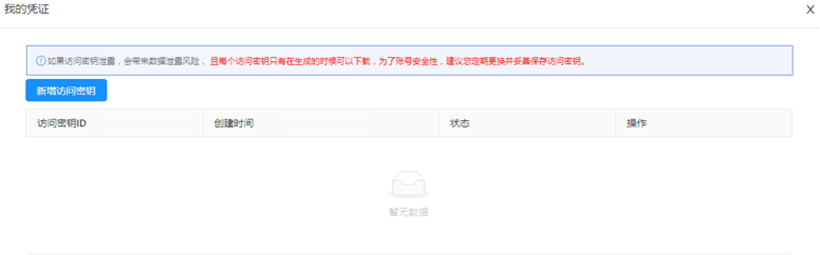
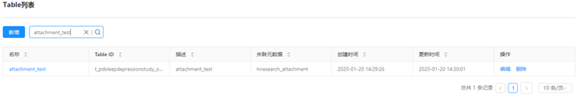

# 1 Python SDK使用指导
## 1.1 简介
Python SDK适用于研究人员使用，在HUAWEI Research的研究分析portal页面获取到个人凭证，然后使用该凭证完成与HUAWEI Research创新研究平台的鉴权后，通过相关API读取与分析研究数据表中的数据。
在使用Python SDK前，您需要：
	了解HUAWEI Research创新研究平台，熟悉“研究分析”->“数据表”页面用法。
	登录HUAWEI Research的portal平台，打开“我的 > 我的凭证”，获取到accessKey与secretKey。
本文档详细介绍了Python SDK的安装、鉴权、数据表查询等API及其示例。
## 1.2 安装
本章节介绍如何安装Python SDK及环境配置。
### 1.2.1 环境准备
HUAWEI Research Python SDK适用于Python3.6及以上版本。
	安装Python
根据Python官网的引导安装合适的Python3.6及以上版本。
	查看Python是否安装成功
执行命令python -V查看Python版本。
Windows环境中，如果提示“不是内部或外部命令”，请在环境变量中编辑Path，增加Python和pip的安装路径。pip的安装路径一般为Python所在目录的Scripts文件夹。
### 1.2.2 安装SDK
登录HUAWEI Research后，单击“支持”->“开发工具包”，下载Python SDK工具包。
通过pip命令安装Python SDK，执行命令如下：
```bash
    pip install huaweiresearchsdk-1.0.0-py3-none-any.whl
```
	如果您的环境尚未安装pip，请参见pip官网安装。
	如果已安装旧版本的Python SDK，建议先卸载已有版本，然后再安装新版本的SDK。
SDK安装成功提示如下图：
图1-1 SDK安装成功1


### 1.2.3 卸载SDK 
通过pip卸载，执行命令如下：
```bash
pip uninstall huaweiresearchsdk
```
## 1.3 获取凭证
本章节介绍如何获取凭证。
步骤 1	打开HUAWEI Research研究分析平台Portal页面，华为账号登录成功后。

步骤 2	鼠标移动到右上角用户名上，弹出按钮菜单，单击“我的凭证”，弹出如下弹框：
图1-2 我的凭证


步骤 3	点击“新增访问密钥”，如下图所示：
图1-3 新增访问密钥


步骤 4	请妥善保存密钥ID（accessKey）和密钥（secretKey），关闭该页面后就不能再次查看到密钥，每个用户最多可以创建2个密钥。
----结束

## 1.4 初始化
初始化BridgeConfig，HttpClientConfig和BridgeClient类。
样例代码如下：
```python
from hiresearchsdk import BridgeClient 
from hiresearchsdk.config import BridgeConfig, HttpClientConfig 
# 初始化BridgeConfig类 
bridgeconfig = BridgeConfig("product", "<accessKey>", "< secretKey>") 
# 连接超时时间，单位s，不设置则默认30s 
connect_timeout = 200 
# 等待接口返回超时时间，单位s，不设置则默认30s 
read_timeout = 200 
# 是否失败重试，默认不重试 
retry_on_fail = True 
# 初始化HttpClientConfig类 
httpconfig = HttpClientConfig(connect_timeout, read_timeout, retry_on_fail) 
bridgeclient = BridgeClient(bridgeconfig, httpconfig) 
```
## 1.5 获取项目信息
本章节介绍如何使用Python SDK获取当前用户加入项目的ProjectId和ProjectCode。在后期调用查询数据表和下载附件接口中需要使用项目的ProjectId和ProjectCode信息。
样例代码如下：
```python
from huaweiresearchsdk.bridge import BridgeClient
from huaweiresearchsdk.config import BridgeConfig, HttpClientConfig

# 初始化BridgeConfig类(环境、ak、sk)
bridge_config = BridgeConfig("product", " <yourAccessKey>",
" <yourSecretKey>")
# 连接超时时间，单位s，不设置则默认30s
connect_timeout = 200
# 等待接口返回超时时间，单位s，不设置则默认30s
read_timeout = 200
# 是否失败重试，默认不重试
retry_on_fail = True
# 初始化HttpClientConfig类
http_config = HttpClientConfig(connect_timeout, read_timeout, retry_on_fail)
bridge_client = BridgeClient(bridge_config, http_config)
# 获取已加入项目项目信息
projects = bridge_client.get_bridgedata_provider().list_projects()
print(projects)
```
查询成功后，返回数据如下：
```json
{
	{
		"projectId"  :"xxxxxxxxxxx",
		"projectName":"xxxxxxxxxxx",
		"projectCode":"xxxxxxxxxxx"
	},
	{
		"projectId"  :"xxxxxxxxxxx",
		"projectName":"xxxxxxxxxxx",
		"projectCode":"xxxxxxxxxxx"
	}
}
```
请获取对应项目的projectId及projectCode用于后面查询数据表及下载附件。

## 1.6 查询数据表
本章节介绍如何使用过滤条件查询研究数据表。
SearchTableDataRequest查询请求中包含的参数列表如下：

表1-1 SearchTableDataRequest请求参数
| 参数名             | 数据类型 | 说明                                                                                         | 必选M/可选O |
|---------------------|----------|--------------------------------------------------------------------------------------------|-------------|
| accessToken        | String   | 鉴权获取到的accessToken。                                                                  | M           |
| table_id           | String   | 查询表的Table ID，可在数据表列表页面中查看到相应数据表的Table ID。                         | M           |
| filters            | List     | 过滤器列表                                                                                 | O           |
| desired_size       | int      | 查询数据表时，每页数据条数。默认5000条                                                     | O           |
| sorts              | list     | 排序字段列表                                                                               | O           |
| include_fields     | list     | 需查询的列字段，不指定返回全部字段                                                         | O           |
| exclude_fields     | list     | 查询结果不需要返回的字段。<br>**注意**<br>该参数不能与include_filelds同时使用。             | O           |
| aggregation_info   | object   | 聚合查询条件。<br>具体请参考“5.4.3.2 聚合查询数据表”。                                      | O           |
| giveup_when_more_than | int      | 设置查询的最大条数。当查询结果条数超过该参数的值，只取该参数值所设置的条数。               | O           |


使用过滤条件，简单查询出数据表数据。
举例：查询如下数据表（Table ID：t_d403a60b_userbasicinfo_system）：
图1-4 数据表1


图1-5 数据表2


样例代码如下：
```python
from huaweiresearchsdk.bridge import BridgeClient
from huaweiresearchsdk.config import BridgeConfig, HttpClientConfig
from huaweiresearchsdk.model.table import FilterCondition, FilterOperatorType, SearchTableDataRequest, FilterLogicType
import json

# 初始化BridgeConfig类(环境、ak、sk)
bridge_config = BridgeConfig("product", "<yourAccessKey>", "< yourSecretKey>")
# 连接超时时间，单位s，不设置则默认30s
connect_timeout = 200
# 等待接口返回超时时间，单位s，不设置则默认30s
read_timeout = 200
# 是否失败重试，默认不重试
retry_on_fail = True
# 初始化HttpClientConfig类
http_config = HttpClientConfig(connect_timeout, read_timeout, retry_on_fail)
bridge_client = BridgeClient(bridge_config, http_config)
# 项目id--从list_projects()方法结果中取
project_id = '<yourProjectId>'
# 所查询数据表的Table ID
table_id = '<yourTableID>'
# 单个条件查询(时间过滤是13位时间戳)
condition = [FilterCondition("healthid", FilterOperatorType.EQUALS, '75e550ed040f4f35a8c8f818ca600894')]
# 多条件联合查询
# FilterLogicType 用于拼接两个过滤条件，or：“或”关系，and：“且”关系，样例中以单个条件为例
# subconditions = [FilterCondition("uploadtime", FilterOperatorType.LESS_THAN, 1658995540652, logic=FilterLogicType.AND)
#             , FilterCondition("recordtime", FilterOperatorType.GREATER_THAN, 1657440340652)]
# condition = [FilterCondition("maxHeartRate.value", FilterOperatorType.GREATER_EQUALS, 150,
#                                       logic=FilterLogicType.AND,
#                                       sub_conditions=subconditions)]
# 包含字段
include_fields = ['healthid', 'recordtime', 'height.bodyHeight.value', 'weight.bodyWeight.value', 'age', 'joinTime', 'appVersion']
# 当查询结果超过单页记录数时，建议增加排序字段  type值为desc(降序排列)，asc(升序排列)
sortfields = [{"name": "recordtime", "type": "desc"}]
# 构造查询请求
req = SearchTableDataRequest(table_id, filters=condition, desired_size=1000,sorts=sortfields,include_fields=include_fields,giveup_when_more_than=1000,project_id=project_id)
rs = list()
# 构造回调函数
def rows_processor(rows, totalCnt):
    print("totalCnt: ", totalCnt, "len(rows): ", len(rows))
    rs.extend(rows)
bridge_client.get_bridgedata_provider().query_table_data(req, callback=rows_processor)
print(json.dumps(rs))
```

查询数据表的条件过滤操作类型（FilterOperatorType）支持如下：

表1-2 FilterOperatorType
| FilterOperatorType   | 说明             |
|----------------------|------------------|
| `EQUALS`             | 等于             |
| `NOT_EQUALS`         | 不等于           |
| `CONTAINS`           | 包含             |
| `GREATER_THAN`       | 大于             |
| `LESS_THAN`          | 小于             |
| `GREATER_EQUALS`     | 大于等于         |
| `LESS_EQUALS`        | 小于等于         |
| `EXISTS`             | 字段存在         |
| `NOT_EXISTS`         | 字段不存在       |
| `IN`                 | 在列表中         |
| `NOT_IN`             | 不在列表中       |


## 1.7 下载附件字段
本章节介绍如何下载数据表中数据类型为ATTACHMENT的字段附件内容。
Attachment字段的内容为用户所上传附件的存储地址，Python SDK根据附件的存储地址下载附件。
1.	举例：查询如下数据表的objectKey字段：
图1-6 Attachment数据表1


图1-7 Attachment数据表2


图1-8 Attachment数据表3


样例代码如下：
```python
from huaweiresearchsdk.bridge import BridgeClient
from huaweiresearchsdk.config import BridgeConfig, HttpClientConfig
from huaweiresearchsdk.model import BatchGetFileRequest
# 初始化BridgeConfig类(环境、ak、sk)
bridge_config = BridgeConfig("product",  "<yourAccessKey>",  "< yourSecretKey>")
# 连接超时时间，单位s，不设置则默认30s
connect_timeout = 200
# 等待接口返回超时时间，单位s，不设置则默认30s
read_timeout = 200
# 是否失败重试，默认不重试
retry_on_fail = True
# 初始化HttpClientConfig类
http_config = HttpClientConfig(connect_timeout, read_timeout, retry_on_fail)
bridge_client = BridgeClient(bridge_config, http_config)
# 项目id--从list_projects()方法结果中取
project_id = '<yourProjectId>'
# 文件对象objectKey列表（可从页面拷贝路径中获取或者从list_objects方法结果中获取）
file_patchs = ['attachments/d403a60b/c56f760a0a6c464b948e8c5b6b129ba4/20220805/ECG/ecg-1659666867351-id46H1I0Rsw7ReBHQYpLAg==.zip', 'attachments/d403a60b/1bd2c10ccb094485acd9b5ecc198662d/20220809/DetectErrorResult/vascularPPG-1660012557904-G1RHLefChPRGWvGrPAjdLg==.zip',
            'attachments/d403a60b/1bd2c10ccb094485acd9b5ecc198662d/20220809/DetectErrorResult/vascularECG-1660012557884-G1RHLefChPRGWvGrPAjdLg==.zip', 'attachments/d403a60b/1bd2c10ccb094485acd9b5ecc198662d/20220809/DetectErrorResult/vascularACC-1660012557909-G1RHLefChPRGWvGrPAjdLg==.zip']
# 文件下载到本地的目标目录
output_path = 'D:/fileDownload'
req = BatchGetFileRequest(filepaths=file_patchs, output_path=output_path,project_id=project_id)
bridge_client.get_bridgedata_provider().batch_download_file(req)
```

2.	举例：下载元数据ECG中的ecg字段值。如下图所示：
图1-9 ECG数据表


图1-10 ecg字段显示图片


样例代码如下：
```python
from huaweiresearchsdk.bridge import BridgeClient
from huaweiresearchsdk.config import BridgeConfig, HttpClientConfig
from huaweiresearchsdk.model import BatchGetFileRequest
from huaweiresearchsdk.model.table import FilterCondition, FilterOperatorType, SearchTableDataRequest, FilterLogicType
import json

# 初始化BridgeConfig类(环境、ak、sk)
bridge_config = BridgeConfig("product", " <yourAccessKey>",
" <yourSecretKey>")
# 连接超时时间，单位s，不设置则默认30s
connect_timeout = 200
# 等待接口返回超时时间，单位s，不设置则默认30s
read_timeout = 200
# 是否失败重试，默认不重试
retry_on_fail = True
# 初始化HttpClientConfig类
http_config = HttpClientConfig(connect_timeout, read_timeout, retry_on_fail)
bridge_client = BridgeClient(bridge_config, http_config)
# 项目id--从list_projects()方法结果中取
project_id = '47a480f598ba441cb982264d132d4fdd'

# 所查询数据表的Table ID
table_id = 't_d403a60b_ecg_system'
# 单个条件查询(时间过滤是13位时间戳)
conditions = [FilterCondition("healthid", FilterOperatorType.EQUALS, '4ad11cccc3de4496ae5c9cabfe8b340d', logic=FilterLogicType.AND)
              , FilterCondition("recordtime", FilterOperatorType.GREATER_THAN, 1660690533000)]
include_fields = ['healthid', 'recordtime', 'ecg']
# 当查询结果超过单页记录数时，建议增加排序字段  type值为desc(降序排列)，asc(升序排列)
sortfields = [{"name": "recordtime", "type": "desc"}]
# 构造查询请求
req = SearchTableDataRequest(table_id, filters=conditions, desired_size=1000,sorts=sortfields,include_fields=include_fields,giveup_when_more_than=1000,project_id=project_id)
rs = list()
# 构造回调函数
def rows_processor(rows, totalCnt):
    print("totalCnt: ", totalCnt, "len(rows): ", len(rows))
    rs.extend(rows)
bridge_client.get_bridgedata_provider().query_table_data(req, callback=rows_processor)

ecglist = []
for i in range(len(rs)):
    tmp = rs[i]
    ecglist.append(tmp['ecg'])
print(ecglist)
# 文件下载到本地的目标目录
output_path = 'D:/fileDownload'
req = BatchGetFileRequest(filepaths=ecglist, output_path=output_path, project_id=project_id)
bridge_client.get_bridgedata_provider().batch_download_file(req)
```